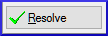

title: 15. UN - Using Notes

**Introduction**
As you are translating and checking you may want to make comments on various errors or issues. You may also want to record your discussions on key terms and spelling issues. Paratext 9 allows you to record these comments either in the text, the Biblical terms list or the wordlist.

**Where we are**
You are typing or revising your text, wordlist or keyterms and need to make comments on an issue you have seen.

:::caution

Notes and footnotes are very different. Footnotes are printed in the New Testament whereas notes are for questions and comments and are not printed in the New Testament. :::

**What you are going to do**
You will:

- add more note types (administrator only)
- create notes in the text using different icons,
- open, edit, and resolve notes
- open a notes list
- filter the list
- print a list of the notes

### 15.1 Different types of project notes

You can choose from many different icons for your project notes in Paratext 9:

:::tip

Don't have too many icons! :::

**An icon can have four different colours or shapes**

| Icon has a border and a yellow background color.          | The note has a least one unread comment.                                                                 | [/tmp/f50f10bf-a838-4d61-8f45-29d8f4355bea/media/image2.jpeg](https://s3-us-west-2.amazonaws.com/secure.notion-static.com/b4ce1024-9bb7-450a-b2dd-6ad0fcb1de9d/image2.jpeg) |
| --------------------------------------------------------- | -------------------------------------------------------------------------------------------------------- | --------------------------------------------------------------------------------------------------------------------------------------------------------------------------- |
| Icon is red, purple, or light blue.                       | A project note assigned to you, or to the whole team, or unassigned.                                     | [/tmp/f50f10bf-a838-4d61-8f45-29d8f4355bea/media/image3.png](https://s3-us-west-2.amazonaws.com/secure.notion-static.com/5546df31-3aa1-41f7-9a16-efc0139ebd05/image3.png)   |
| Icon is gray.                                             | A project note assigned to someone else.                                                                 | [/tmp/f50f10bf-a838-4d61-8f45-29d8f4355bea/media/image4.png](https://s3-us-west-2.amazonaws.com/secure.notion-static.com/154a2514-14e9-47ac-9a2c-d0b0af6ea47c/image4.png)   |
| Icon has a border and a yellow background color.          | The note has a least one unread comment.                                                                 | [/tmp/f50f10bf-a838-4d61-8f45-29d8f4355bea/media/image5.png](https://s3-us-west-2.amazonaws.com/secure.notion-static.com/dceddaeb-a781-4aa4-840d-a72f76d0f9a1/image5.png)   |
| Icon is red, purple, or light blue.                       | A project note assigned to you, or to the whole team, or unassigned.                                     | [/tmp/f50f10bf-a838-4d61-8f45-29d8f4355bea/media/image6.png](https://s3-us-west-2.amazonaws.com/secure.notion-static.com/218e0372-ee13-4acf-bb5d-b25dad393268/image6.png)   |
| Icon is gray.                                             | A project note assigned to someone else.                                                                 | [/tmp/f50f10bf-a838-4d61-8f45-29d8f4355bea/media/image7.png](https://s3-us-west-2.amazonaws.com/secure.notion-static.com/22a176d9-c4db-4087-a133-9b5c1fd62c43/image7.png)   |
| Icon is gray with a green tick.                           | A project note with resolved status.                                                                     | [/tmp/f50f10bf-a838-4d61-8f45-29d8f4355bea/media/image8.png](https://s3-us-west-2.amazonaws.com/secure.notion-static.com/a67f978e-4e11-4ba1-8bf3-c33852bf71ee/image8.png)   |
| Icon is a white question mark on the cover of a book.     | There is a spelling discussion note for this word. (Wordlist only.)                                      | [/tmp/f50f10bf-a838-4d61-8f45-29d8f4355bea/media/image9.png](https://s3-us-west-2.amazonaws.com/secure.notion-static.com/16e80d54-18f1-4694-bbc7-8942fb6e855c/image9.png)   |
| Icon is gray with a question mark on the cover of a book. | There is NOT a spelling discussion note for this word. (Wordlist only. )                                 | [/tmp/f50f10bf-a838-4d61-8f45-29d8f4355bea/media/image10.png](https://s3-us-west-2.amazonaws.com/secure.notion-static.com/eb01a6d3-df78-4892-85ec-bda663b5a04d/image10.png) |
| Icon is a light blue plus.                                | A consultant note.                                                                                       | [/tmp/f50f10bf-a838-4d61-8f45-29d8f4355bea/media/image11.png](https://s3-us-west-2.amazonaws.com/secure.notion-static.com/bd7076e3-16d5-49cb-a460-557c98119f78/image11.png) |
| Icon is a light blue globe.                               | A global consultant note.                                                                                | [/tmp/f50f10bf-a838-4d61-8f45-29d8f4355bea/media/image12.png](https://s3-us-west-2.amazonaws.com/secure.notion-static.com/2b49596b-dc6e-4d80-875c-35d39761d440/image12.png) |
| Icon is a black exclamation point within a red triangle.  | There is a Send/Receive merge conflict because two users have made different changes to the same verse.  |                                                                                                                                                                             |
| Icon is a white arrow on a blue background.               | There is a rendering discussion note for this Biblical Term. (4c.Biblical terms window or tool only)     |                                                                                                                                                                             |
| Icon is gray with an arrow on the cover of a book.        | There is NOT a rendering discussion note for this Biblical Term. (4c.Biblical terms window or tool only) |                                                                                                                                                                             |

[child_database](b68b2a99-2153-4029-9bfd-57e8084bbb56)

**Setup additional note types**

:::caution

One must be an Administrator :::

- **≡ Tab**, under > **Project** > **Project settings** > **Project properties**
- Click the **Notes** tab
- Click on the **Add** Tab button
	- _A new line is added._
- Click the icon on the new tag line
- Choose the desired icon
- Type a name for the new note type
- Continue for any other new notes.

### 15.2 Using notes

**Inserting a project note**

- Click in the text where you want the note (and select any appropriate text).
- **≡ Tab**, under **Insert** > **Note**
- Choose the desired tag for the note from the list

	

- Type the text for the note
- Click **OK**.
	- _An icon is displayed beside the text._

**Add comments to an existing note**

- Click the icon() in the text

	

	- _The note opens_.

		

- Type a note
- Click **OK**

**Assign a note to someone**

- Click the icon () in the text.

	

- Type your comments
- Click **Assign to**
- Choose as desired
- Click **OK**

**Apply notes to multiple projects**

- Open the note from the text
- Click the **Multiple** button
- Choose the projects
- Click **OK**
- Click **OK** again to close the dialog box.

**Reattach note**

- Click the note icon in the text to open the note.

	

- Click the Reattach Note button (on the toolbar)

	

- Select the word(s) to attach it to.
- Click **OK**.
	- _The note is attached to the word(s)._

**Resolve a note**

- Click on the icon () in the text

	

- Type another comment if necessary.
- Click the **Resolve** button

	

- Click **OK**

**Delete notes**

- Click the note icon
- Click the small red x
- Click **Yes** to permanently delete you comment.
- If there are more comments, continue to delete the next comment.

### 15.3 Open a Notes List

When reviewing notes, it is often helpful to see them in a list.

- **≡ Tab**, under **Tools** > **Notes list**
- Select your project.
- Click **OK**.
	- _A note list window opens._

		

- Adjust the filters as needed.

	:::tip

	If the window is blank, then change the filters using the filter buttons on the toolbar (see below). :::

**Notes window toolbar**
There are four dropdown boxes on the toolbar

- Notes filter
- Verse filter
- Search
- Sort by [verse, date, assigned to]

**Notes list filter**

- Click the first button/list
- Choose an existing filter as appropriate

**Define a new filter**

- Click the first button/list
- Choose **New filter**

	

- Choose the status, tag, person and date as desired.
- Click **OK**

**Save a filter**

- Define the filter as needed.
- Click in the textbox at the top left (1).

	

- Type a name for the filter
- Click the save icon (2).

### 15.4 Add comments from a notes window

- Click arrow to expand the note ()

	

	- _The note opens,_
- Type your comments in the textbox.

	

- Resolve or assign the note as needed.
- Click the arrow to collapse the note.

### 15.5 Print a notes report

- Click in a notes window.
- Filter the list as desired.
- **≡ Tab**, under **Project** > **Print**
- Choose the printer and any options.
- Click **OK**.
- Close the window.
