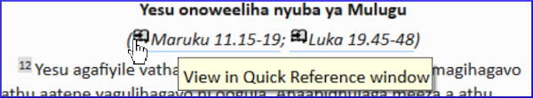

### Open a quick reference window:

- Click on a link in \r line or \xt

	

	- _The Quick Reference window comes up showing me that other reference_.
	OR
- Click the **≡ menu** for the project, expand the menu, under **Tools** > **Quick Reference**

:::tip

If you add the window to Autohide, or Dock the window, Paratext will use it to open parallel heading links or cross reference links. :::

:::caution Upgrade

From **Paratext 9.1** any floating window has controls for changing the **reference**.

From **Paratext 9.3** any floating window also has controls for changing the **project**. :::

