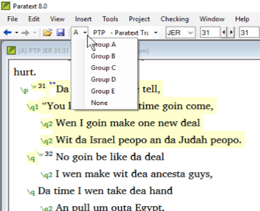

## -- title: Scroll group (0.2.3a)

Scroll groups allow you to look up a different reference without having all the windows scroll to the new reference,

Paratext allows up to five different scroll groups, A through E. In addition, we can choose “none.”

The small dropdown control which contains the letter A is how we control the scroll groups.

### Change scroll group

- Click to activate the window
- Click the scroll group on the toolbar
- Choose the desired scroll group

	

	- _Small letters are shown next to the project abbreviations on the window title bars when the windows are not all in group A_.

:::tip

When you open a new window, it will be in the same scroll group as the last active one. :::

