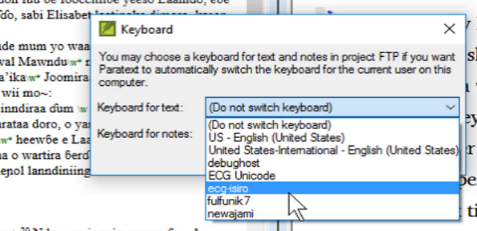

## -- title: Keyboard (0.2.3b)

Paratext can be set to turn on a keyboard automatically when the cursor is in a project that needs it.

- Click the **Project** menu
- Move the mouse over **Project Settings**.
- In the submenu, select **Keyboard**.
	- The Keyboard dialog for this project opens.

		

- Choose the Keyman keyboard for typing text.
- Choose the Keyboard for typing notes.
- Click **OK**.
