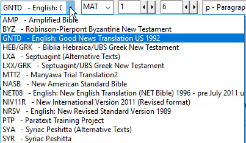

## -- title: Swap text in a window (0.2.3c)

You can change which text a window displays. This is a way of opening a different text instead of one of your open ones, leaving your window layout the same.

- On the toolbar, click the project list.
- 

	

- Select the text you wish to display.
	- _The window now shows the new version instead and the window layout remains the same_.

:::note

At this time, you can only open another similar resource in the window using the project list (i.e Project, Enhance Resource, Biblical terms). :::

:::tip

Remember if the saved layout contains the other version, it will be re-opened if you use the saved layout again. If the **current text** selection is what you want to use in future, **re-save the layout** as it currently is. :::

