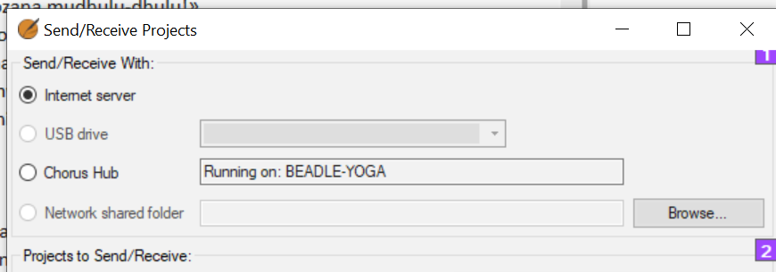

## -- title: Send/Receive for the first time (0.4.1)

When you hear that the administrator has added you to the project, use the Send/Receive command to get a copy of the project on your computer.

### Send/receive by Internet

- Open the main Paratext menu **≡.**
- Click **Send/receive projects**
- Choose the appropriate method (**Internet** or **USB** see below)
- Choose the project (**New** means new to my computer)
- Click **Send/receive** button
	- _Project will open_.

### Send/receive by USB

- **Insert USB** into computer
- Open the main Paratext menu.
- Click **Send/receive projects**
- Choose **USB drive**
	- _If it is greyed out, cancel and insert USB_
- Choose project (**New** means new to my computer)
- Click **Send/receive** button
	- _Project will open_.

### Send/receive by Network folder

- File > Send/receive projects
- Choose Network Shared folder
- Click browse and choose the network folder
- Choose project (New means new to my computer)
- Click Send/receive button
	- _Project will open_.
