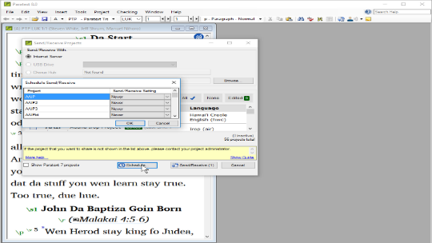

## -- title: Working in a shared project (0.4c)

In this video, you learnt about using send/receive regularly to keep sharing your work with your colleagues, and to receive their changes.

### Send/receive – icon on taskbar

Use the shortcut icon on taskbar to do the same type of send/receive.

### Send/receive – project menu ≡

- Click the project **≡ menu**
- Choose Send/Receive this project

### Schedule Send/Receive

- Click the main **≡ menu** Paratext
- Choose **Send/Receive projects**
- 

	

- Click **Schedule**
- Select the project
- Choose schedule setting (hourly, every four hours, daily, or on startup and shutdown)
- Click **OK** to set the schedule
- Click **Cancel** to close Send/receive dialog.
