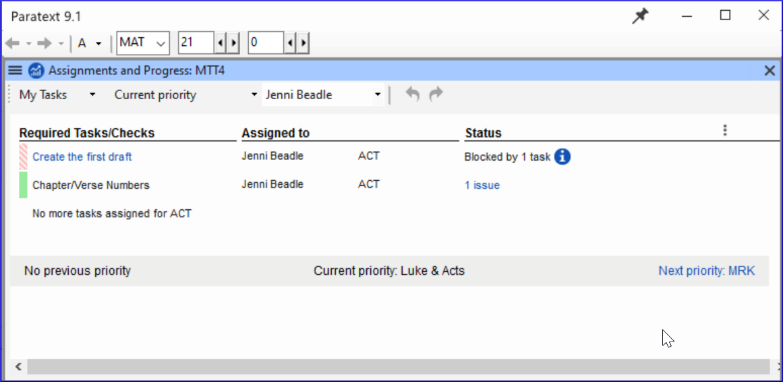

title: My Tasks - Project Plan (1.1)

The administrator of your project can assign tasks to you in Paratext. The task assignments control what you can edit.

## View tasks assigned to you

- Click on the blue button to open Assignments and progress.

	

	- _The Assignments and Progress window opens, showing_ _**My Tasks**_ _in the_ _**Current Priority**_ _or the last view_.
- 

	

## Next/Previous Links

- **Prev priority** – previous book with tasks
- **Next priority**next book with tasks
- Change to **All Tasks** – to see tasks waiting

## View tasks by book

- Where it says **Current Priority**, click to view the menu.
- Click **Current Book**.
	- _This is the default filter if your administrator has not set up Priorities_.
- View tasks in another book by clicking **Next book** or **Previous book**.

## State of tasks

- **Green**: Tasks that can be started right away are marked with **green**.
- **Striped green**: Waiting on you to finish another task.
- **Red:** Tasks are dependent on earlier tasks being finished by others.
- **Grey**: Task is complete

**See more information**

- Hover the mouse over the **information icon** to find out what is blocking it.
- Click **Show more tasks** to see hidden tasks.
